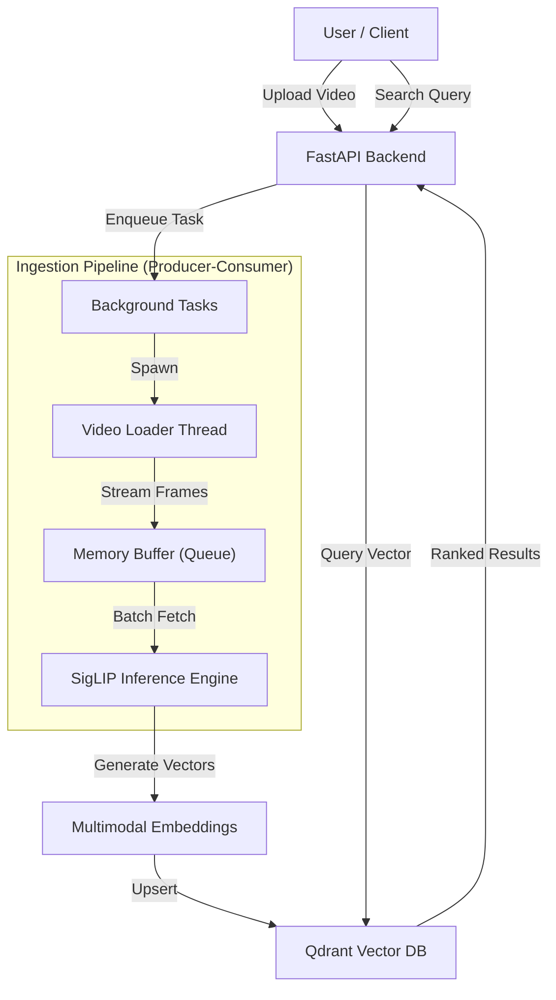

# 🔍 Semantic Video Search Engine 


> **"Find the exact moment a car crashes"** or **"Show me someone cooking pasta"**  across hours of videos, in milliseconds.

A high-throughput, horizontally scalable video search engine powered by **Google's SigLIP** (Sigmoid Loss for Language Image Pre-Training) and **Qdrant**. Designed for production environment with asynchronous processing, producer-consumer pipelines, and multi-tenancy.

---

## Performance Markers

| Benchmark | Result | Environment |
| :--- | :--- | :--- |
| **Throughput** | ~21 Seconds for 25 mins of video | T4 GPU (Google Colab) |
| **Inference Latency** | < 100ms per batch (32 frames) | RTX 3060 Mobile |
| **Search Speed** | < 10ms (100k vectors) | Qdrant (HNSW Index) |

---

## System Architecture

This project has evolved from a simple script into a robust microservice architecture.



### Key Engineering Highlights
*   **Producer-Consumer Pipeline**: Decoupled video decoding (I/O bound) from model inference using threaded queues. This ensures the GPU is never starved of data, resulting in **40%+** faster processing.
*   **Streaming Inference**: Frames are processed in-memory without intermediate disk writes, reducing latency and SSD wear.
*   **Scalable Vector Search**: Migrated from flat files to **Qdrant** for production-ready, filtered vector retrieval (supports millions of vectors).
*   **Asynchronous API**: Built with **FastAPI** to handle concurrent requests and long-running video processing tasks non-blockingly.

---


## Tech Stack

*   **Core Backend**: Python 3.10, FastAPI, Pydantic
*   **AI / ML**: PyTorch, Transformers (Hugging Face), **Google SigLIP** (ViT-B-16)
*   **Computer Vision**: OpenCV (Smart Frame Extraction)
*   **Database**: Qdrant (Vector Store), SQLite/Postgres (Metadata)
*   **Infrastructure**: Docker (planned), AsyncIO

---

## Installation & Usage

### 1. Clone & Setup
```bash
git clone https://github.com/Aniket-16-S/Semantic_Video_Search.git
cd Semantic_Video_Search
pip install -r requirements.txt
```

### 2. Run the Vector Database (Qdrant)
You need a running Qdrant instance. The easiest way is via Docker:
```bash
docker run -p 6333:6333 qdrant/qdrant
```
*Or use Qdrant Cloud for a managed instance.*

### 3. Start the API Server
```bash
uvicorn app.main:app --reload
```
The API will be available at `http://localhost:8000`.

### 4. Interactive Documentation
Go to `http://localhost:8000/docs` to test the endpoints interactively:
*   **POST /upload**: Upload video files for processing.
*   **POST /search**: Search your indexed videos using text.
*   **DELETE /reset**: Clear the index.

---

## Roadmap & Future Improvements

- [x] **v1.0**: Core Script (OpenCV + FAISS)
- [x] **v2.0**: FastAPI Backend + Producer-Consumer Pipeline + Qdrant
- [ ] **v3.0**: Distributed Worker Nodes (Celery/Redis) for horizontal scaling
- [ ] **Frontend**: Dashboard for video managment

---

*Engineered by [Aniket-16-S](https://github.com/Aniket-16-S)*
