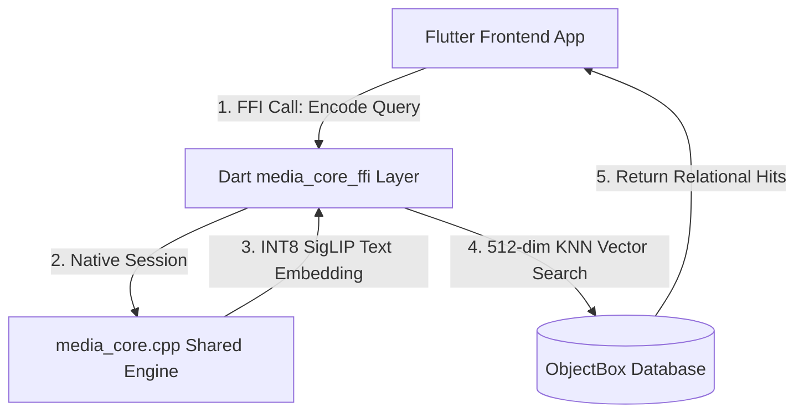

# 100% Offline AI Gallery App (Semantic Video Search Engine)

> High-performance on-device semantic search, audio transcription, and character recognition for Windows & Android.
> Powered by **Flutter**, **ObjectBox DB**, **ONNX Runtime Mobile**, and **Custom C++ Core**.

---

## Architecture Overview

This is a fully offline, edge-native media intelligence application designed for high accuracy and ultra-low resource limits (constrained to a strict **1.5GB RAM active runtime budget**). It completely removes external web interfaces and API endpoints to guarantee privacy.



---

## Performance & Optimization Controls

* **Standardized 512-Dimension Space:** Both visual embeddings (SigLIP) and text queries are down-projected to exactly 512 dimensions before storage to optimize memory usage and index performance.
* **SAD (Sum of Absolute Differences) Frame Sampling:** Native C++ skips redundant frames by evaluating spatial pixel differences, maximizing video processing speed while respecting hardware CPU pipelines.
* **Detached Thread WorkerIsolates:** Heavy decoding processes run on detached Isolate threads via ports to protect the UI thread from dropping below 60FPS.
* **On-Device Extractive TextRank:** Video transcript summarization runs locally using Cosine Similarity matrices over sentence embeddings, completely bypassing cloud dependencies.

---

## Directory Organization

```text
├── media_core_ffi/
│   ├── lib/
│   │   ├── main.dart             # Application initialization
│   │   ├── gallery_screen.dart   # Cinematic dashboard, player, and screens
│   │   ├── media_core_ffi.dart   # Dart FFI bindings and pointer allocations
│   │   ├── database_manager.dart # ObjectBox schemas and local vector queries
│   │   ├── background_worker.dart# Background Worker Isolate loops
│   │   └── text_rank.dart        # Extractive Page/TextRank algorithm
│   │
│   └── native/
│       ├── media_core.h          # Declarations for frame extraction & embeddings
│       └── media_core.cpp        # SAD calculations, Whisper PocketFFT, and projections
│
└── manual_steps.md                # Platform compilation manual
```

---

## Getting Started

To compile, build, and run this application, consult the instructions mapped in [manual_steps.md](./manual_steps.md).
