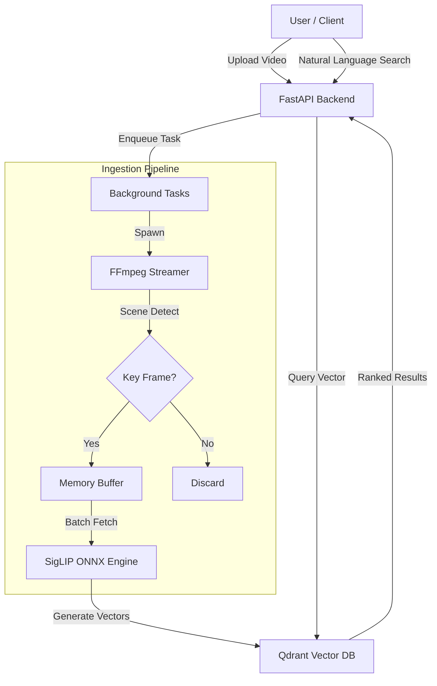

# 🔍 Semantic Video Search Engine


> **"Find the exact moment a car crashes"** or **"Show me someone cooking pasta"** across hours of video in milliseconds.

This is a high-throughput, horizontally scalable video search engine powered by **Google's SigLIP** and **Qdrant**. It transforms raw video data into a searchable semantic space, allowing you to query video content using natural language.

---

## 🚀 Key Engineering Highlights

### 1. Smart Scene-Aware Ingestion
Instead of processing every single frame, the engine uses **PySceneDetect** with content-aware detection.
- **60-80% Reduction** in redundant vector generation.
- **FFmpeg Subprocess Pipe**: Direct memory streaming for faster decoding (bypassing OpenCV overhead).

### 2. Edge-Ready Model Optimization
We've implemented a custom quantization pipeline (`tools/quantize_model.py`):
- **INT8 Quantization**: Shrinks the SigLIP vision encoder from **1.1 GB to ~300 MB**.
- **ONNX Runtime**: Leverages hardware-specific optimizations (AVX2/ARM64) for ultra-fast inference on CPUs.

### 3. High-Concurrency Architecture
- **Producer-Consumer Pipeline**: Decouples I/O bound video decoding from compute-bound inference using threaded queues.
- **Vector Indexing**: Powered by **Qdrant** with HNSW indexing for sub-10ms retrieval across millions of vectors.

---

## 🛠️ Tech Stack

- **ML/CV**: Google SigLIP (ViT-B-16), PyTorch, Hugging Face Transformers, OpenCV, PySceneDetect.
- **Backend**: FastAPI (Asynchronous), Pydantic, Uvicorn.
- **Database**: Qdrant (Vector Store), SQLite (Metadata).
- **Optimization**: ONNX Runtime, Optimum (Quantization).
- **DevOps**: Docker, Docker Compose.

---

## 🏗️ System Architecture



---

## ⚡ Quick Start

### 1. Setup Environment
```bash
git clone https://github.com/Aniket-16-S/Semantic_Video_Search.git
cd Semantic_Video_Search
pip install -r requirements.txt
```

### 2. Launch Services (Docker)
```bash
docker-compose up -d
```
*This starts the API and Qdrant database.*

### 3. Quantize Model (Optional for Performance)
```bash
python tools/quantize_model.py
```

### 4. Search & Explore
Visit `http://localhost:8000/docs` to:
- `POST /upload`: Index your videos.
- `POST /search`: Query using text (e.g., "A dog playing in the park").

---

## 📈 Performance Benchmarks
| Metric | Result | Environment |
| :--- | :--- | :--- |
| **Ingestion Speed** | ~21s for 25m video | T4 GPU |
| **Inference Latency** | < 100ms (32 frames) | RTX 3060 |
| **Model Size** | 300MB (Quantized) | INT8 ONNX |

---

*Engineered for performance and scale by [Aniket-16-S](https://github.com/Aniket-16-S)*
